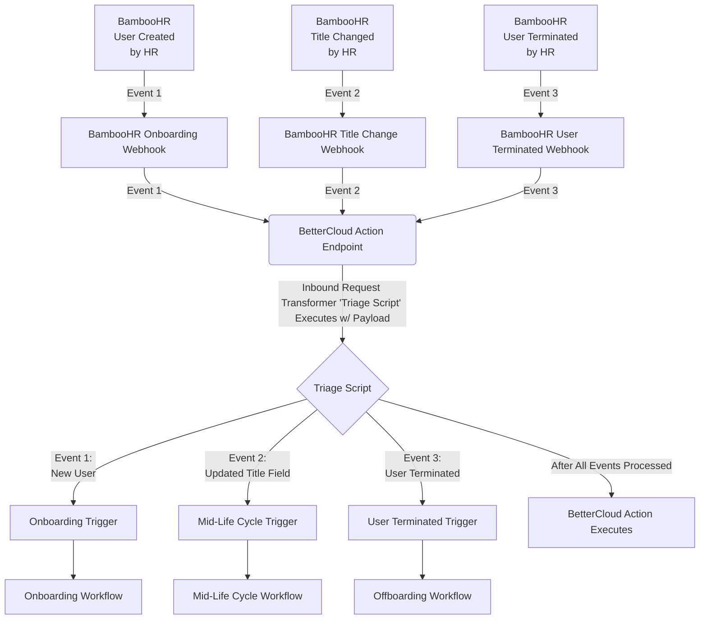

# BetterCloud <> BambooHR Trigger Integration
## Purpose of This Integration
BambooHR sends its webhook data inside of arrays, which BetterCloud doesn't support with Triggers at this time. Currently, any data wrapped in an array is processed as a "JSON Object". 

## How This Works
In a regular BetterCloud Triggering integration, a Trigger endpoint is generated within BetterCloud and then the posting application points a webhook payload towards it. However, since 
BambooHR sends its webhook data inside of arrays, we need to do some pre-processing before that data hits the Trigger endpoint. In order to do this, we instead point the webhook data 
towards a specific BetterCloud endpoint within the _/actions_ API with an "Inbound Request Transformer" (IRT). An IRT is essentially a node.js script that runs before executing a BetterCloud 
action via URL parameters. The IRT is where different event data will be processed and then sent to the appropriate Trigger endpoint.

Example of a _/actions_ endpoint with an IRT parameter: /api/v1/actions/_{ACTION_ID}_/execute?authorization=_{BC_API_TOKEN}_&**BC-Transform-IDs=_{IRT_SCRIPT_ID}_**


### Environment Variables
* bcAdminEmail
* bettercloudIntegrationId
* {type of change}ChangeTrigger

## Preventing BambooHR Infinite Retries
When you create a webhook in BambooHR - it will attempt to send all changes from the inception of the webhook to the endpoint until it receives a 200 for those events, indefinitely. 
If there are issues, a collection of events will continue to grow which can cause issues on BetterCloud due to API limits.

To prevent this, we make sure that our triage scripts properly conditions off the fields that are sent from BambooHR. We also want to properly handles failed conditions not as "errors" 
because if an error occurs in the Inbound Request Transformer, BetterCloud will send back an error code to BambooHR.

Consider this chunk of code that is taken from the Inbound Request Transformer triageScript.js. We make sure to condition off the "triggering" field, in this case it is work email, in 
multiple areas. In the first case the condition ensures sure a user isn't onboarded upon creation. In the second case it exists to prevent the "Field Change" webhook for "department" 
from firing upon creation. **It's important to note that we do not error out on failed conditions, since that will force BambooHR to retry that webhook. We simply update the email status
and fulfill the action so that we return a successful response.**
```javascript
 switch (changedField) {
    case "workEmail":
        if (workEmail !== null && status === "Active") {
            url = secrets.onboardingTrigger;
            statusEmail += `User created in BambooHR and work email was set. Employee data: ${JSON.stringify(employee.fields)}\n`;
        }
        break;
    case "department":
        if (workEmail !== null) {
            url = secrets.departmentChangeTrigger;
            statusEmail += `User's department changed in BambooHR. Employee data: ${JSON.stringify(employee.fields)}\n`
        }
        statusEmail += `Department changed, but Work Email is not set. Perhaps this is a new user? BetterCloud workflow will not run. Employee data: ${JSON.stringify(employee.fields)}\n`;
        break;
    default:
        statusEmail += `No applicable changed fields. No workflow will run. Employee data: ${JSON.stringify(employee.fields)}\n`;
        break;
}
```
## Sometimes Changed Fields Will Come Through As Integers
There are certain change fields that will only come through as integers/IDs. To map these values to the field in BambooHR, use Bamboo's API to fetch the list of fields and their IDs. 
See documentation: https://documentation.bamboohr.com/reference/metadata-get-a-list-of-fields
```javascript
 switch (changedField) {
    case 91: // This is the "supervisorEmail" field ID
        if (workEmail !== null) {
            url = secrets.managerChangeTrigger;
            statusEmail += `User's manager changed in BambooHR. Employee data: ${JSON.stringify(employee.fields)}\n`
        }
        statusEmail += `Manager changed, but Work Email is not set. Perhaps this is a new user? BetterCloud workflow will not run. Employee data: ${JSON.stringify(employee.fields)}\n`;
        break;
}
```
