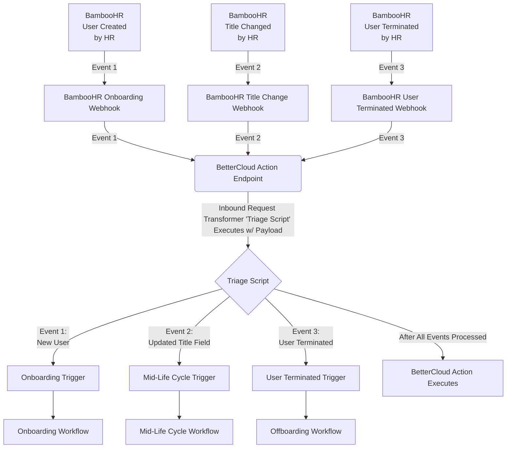

# BetterCloud <> BambooHR Trigger Integration
## Purpose of This Integration
BambooHR sends its webhook data inside of arrays, which BetterCloud doesn't support with Triggers at this time. Currently, any data wrapped in an array is processed as a "JSON Object". 

## How This Works
In a regular BetterCloud Triggering integration, a Trigger endpoint is generated within BetterCloud and then the posting application points a webhook payload towards it. However, since BambooHR sends its webhook data inside of arrays, we need to do some pre-processing before that data hits the Trigger endpoint. In order to do this, we instead point the webhook data towards a specific BetterCloud endpoint within the _/actions_ API with an "Inbound Request Transformer" (IRT). An IRT is essentially a node.js script that runs before executing a BetterCloud action via URL parameters. The IRT is where different event data will be processed and then sent to the appropriate Trigger endpoint.

Example of a _/actions_ endpoint with an IRT parameter: /api/v1/actions/_{ACTION_ID}_/execute?authorization=_{BC_API_TOKEN}_&**BC-Transform-IDs=_{IRT_SCRIPT_ID}_**

NOTE: We are purposefully using BetterCloud's Send Email action since it gives us a form of logging. As a result, much of the documentation will be referencing that action and the script is configured to that action as well. However, this integration can be done with any action. See [Using the BetterCloud /actions API]() for configuration details.



## Using the BetterCloud /actions API
Below are the components needed to properly execute an action via the /actions API. 

### URL
api.bettercloud.com/api/v1/actions/_{ACTION_ID}_/execute?authorization=_{BC_API_TOKEN}_&**BC-Transform-IDs=_{IRT_SCRIPT_ID}_**

### BetterCloud API Token:

To generate this token, open BetterCloud and navigate to “BetterCloud APIs” > “API Token” from the left menu. Click “Create” to create a new token.

This will be placed in the authorization query parameter within the URL string.

### Triage Script ID
This is generated after you've created the Inbound Request Transformer in BetterCloud. The ID will appear under the extension in the "Extensions" tab of your integration.

This will be placed in the BC-Transform-IDs query parameter within the URL string.

### Action ID:
1. Go to BetterCloud  and sign-in 
2. Right-click on the page and select “Inspect” in the dropdown 
3. Chrome will open a side panel, select the Network tab. You may need to click on >> to see it 
4. In the BetterCloud navigation panel select Workflows > New 
5. Type “Actions” in the Filter field of the Chrome Inspect panel 
6. Click on actions?latestOnly=true 
7. Right-click on content  and select copy object in the drop-down 
8. Paste Clipboard contents into your favorite text editor (recommend: Sublime) and save as actions.json

Within actions.json, you should be able to find the ID of any action that is installed in your environment. The below JSON snippet has the action name as well as the ID for BetterCloud's Send Email action. 

```json
{
  "id": "<SOME ID>",
  "version": "0.1.14",
  "providerId": "<SOME PROVIDER ID>",
  "name": "[BetterCloud] Send Email",
  ...
}
```

This ID will be placed in the url path to execute via HTTP request.

### Integration ID/Connector ID:
1. Follow steps 1-4 for getting the Action ID
2. Next, Type “Integrations” in the Filter field of the Chrome Inspect panel 
3. Click on integrations/ 
4. Right-click on content  and select copy object in the drop-down 
5. Paste Clipboard contents into your text editor and save as integrations.json
6. Within integrations.json, search for "bettercloud"
7. Copy the value of the "integrationId"

```json
{
    "integrationId": "<SOME INTEGRATION ID>",
    "externalId": "bettercloud",
    "providerId": "<SOME PROVIDER ID>",
    "providerName": "bettercloud",
    "displayName": "BetterCloud",
    "instanceUrl": null,
    "status": "ACTIVE",
    "scopesUpToDate": true,
    "adminEmail": "<SOME EMAIL>"
}
```

This ID will be set in your BetterCloud environment variables as "bettercloudIntegrationId", and will be used as a value in your script's action request object parameters.

`"b6bea60c-8dc9-4bd9-a950-d5f8aa2c6a60": secrets.bettercloudIntegrationId`

### Parameters
Each action has a set of parameters to run with the action. These parameters may be required or not required. Within our triage script, we are required to build up an object of parameters that the action will execute with.

```javascript
function formatSendEmailRequest(statusEmail) {
    return {
        "29ab12e1-02cb-452f-82a5-9c433a07884c": secrets.bcAdminEmail, // Recipient of Email
        "ec00cb05-0482-4d83-95b1-98e2f71a2058": "BambooHR Webhook Triggered", // Subject of Email
        "d6bcd3b5-656f-453e-a5f1-9f8734b11088": statusEmail, // Body of Email
        "b6bea60c-8dc9-4bd9-a950-d5f8aa2c6a60": secrets.bettercloudIntegrationId // Integration ID unique to Tenant
    }
}
```
The keys in this object are the parameter IDs. These IDs can be located by searching for the "parameters" property within an action object.

The "parameters" property is an array of parameter objects, where each parameter object has its own set of properties such as id, required, name, type, etc. It is important to include every property whose "required" parameter is true.

```json
 "parameters": [
            {
                "id": "<SOME ID>",
                "required": true,
                "sensitive": false,
                "validationExpression": "<SOME ID> != null && <SOME ID> != \"\"",
                "name": "sendTo",
                "type": "STRING",
                "contextClass": "BCUser",
                "securityStrategy": "",
                "path": "$.input.sendTo",
                "supportsExternalEntity": false,
                "useMadLibTextOnHistory": false,
                "ignoreParentContext": false,
                "ignoreDefaultValue": false,
                "fieldId": "<SOME ID>"
            },
            {
                "id": "<SOME ID>",
                "required": false,
                "sensitive": false,
                "validationExpression": "true",
                "name": "cc",
                "type": "STRING",
                "contextClass": "BCUser",
                "securityStrategy": "",
                "path": "$.input.cc",
                "supportsExternalEntity": false,
                "useMadLibTextOnHistory": false,
                "ignoreParentContext": false,
                "ignoreDefaultValue": false,
                "fieldId": "<SOME ID>"
            },
```
## Environment Variables
* bcAdminEmail (Only use this if you're using BetterCloud's Send Email Action)
* bettercloudIntegrationId
* {type of change}ChangeTrigger (You may have multiple of these depending on the amount of triggering URLs you generate)

## Preventing BambooHR Infinite Retries
When you create a webhook in BambooHR - it will attempt to send all changes from the inception of the webhook to the endpoint until it receives a 200 for those events, indefinitely. If there are issues, a collection of events will continue to grow which can cause issues on BetterCloud due to API limits.

To prevent this, we make sure that our triage scripts properly conditions off the fields that are sent from BambooHR. We also want to properly handles failed conditions not as "errors"because if an error occurs in the Inbound Request Transformer, BetterCloud will send back an error code to BambooHR.

Consider this chunk of code that is taken from the Inbound Request Transformer triageScript.js. We make sure to condition off the "triggering" field, in this case it is work email, in multiple areas. In the first case the condition ensures sure a user isn't onboarded upon creation. In the second case it exists to prevent the "Field Change" webhook for "department"from firing upon creation. **It's important to note that we do not error out on failed conditions, since that will force BambooHR to retry that webhook. We simply update the email status and fulfill the action so that we return a successful response.**
```javascript
 switch (changedField) {
    case "workEmail":
        if (workEmail !== null && status === "Active") {
            url = secrets.onboardingTrigger;
            statusEmail += `User created in BambooHR and work email was set. Employee data: ${JSON.stringify(employee.fields)}\n`;
        }
        break;
    case "department":
        if (workEmail !== null) {
            url = secrets.departmentChangeTrigger;
            statusEmail += `User's department changed in BambooHR. Employee data: ${JSON.stringify(employee.fields)}\n`
        }
        statusEmail += `Department changed, but Work Email is not set. Perhaps this is a new user? BetterCloud workflow will not run. Employee data: ${JSON.stringify(employee.fields)}\n`;
        break;
    default:
        statusEmail += `No applicable changed fields. No workflow will run. Employee data: ${JSON.stringify(employee.fields)}\n`;
        break;
}
```
## Sometimes Changed Fields Will Come Through As Integers
There are certain change fields that will only come through as integers/IDs. To map these values to the field in BambooHR, use Bamboo's API to fetch the list of fields and their IDs. 
See documentation: https://documentation.bamboohr.com/reference/metadata-get-a-list-of-fields
```javascript
 switch (changedField) {
    case 91: // This is the "supervisorEmail" field ID
        if (workEmail !== null) {
            url = secrets.managerChangeTrigger;
            statusEmail += `User's manager changed in BambooHR. Employee data: ${JSON.stringify(employee.fields)}\n`
        }
        statusEmail += `Manager changed, but Work Email is not set. Perhaps this is a new user? BetterCloud workflow will not run. Employee data: ${JSON.stringify(employee.fields)}\n`;
        break;
}
```
